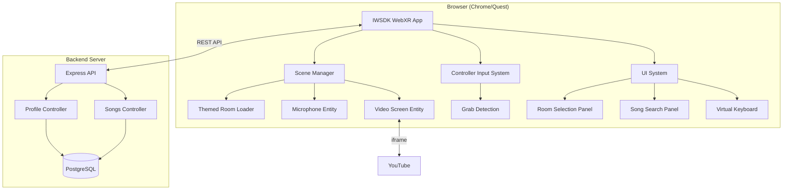

# KaraokeVerse Design Document

## Overview

KaraokeVerse is a browser-native VR karaoke application built with Meta's Immersive Web SDK (IWSDK). The application provides a single-player karaoke experience where users can enter themed virtual rooms, grab a virtual microphone using VR controllers, and sing along to YouTube karaoke videos displayed on a virtual screen. Development uses Chrome with WebXR Emulator on macOS.

The architecture follows a client-server model:
- **Frontend**: IWSDK + TypeScript WebXR application running in Meta Quest browser
- **Backend**: Node.js/Express REST API with PostgreSQL database

The MVP prioritizes simplicity and fast iteration over feature completeness, deferring multiplayer synchronization to future versions.

## Architecture



### Key Architectural Decisions

1. **IWSDK over custom WebXR**: Leverages Meta's optimized SDK with built-in controller and grabbing support
2. **Controller-first development**: Uses WebXR Emulator in Chrome for development; works on Quest with real controllers
3. **YouTube iframe embedding**: Avoids music licensing complexity by using YouTube's existing infrastructure
4. **REST API over WebSockets**: Simpler implementation sufficient for profile storage; no real-time sync needed in MVP
5. **PostgreSQL**: Reliable relational database for structured player and song data
6. **Single-player first**: Reduces complexity dramatically; multiplayer can be layered on later

## Components and Interfaces

### Frontend Components

#### 1. App Entry Point (`src/index.ts`)
- Initializes IWSDK application
- Configures WebXR session with controller input
- Sets up scene graph and event loop

```typescript
interface AppConfig {
  vrMode: 'vr' | 'ar';
  grabbing: boolean;
}
```

#### 2. Scene Manager (`src/scenes/SceneManager.ts`)
- Manages loading/unloading of themed rooms
- Handles transitions between room selection and active room

```typescript
interface SceneManager {
  loadRoom(theme: RoomTheme): Promise<void>;
  unloadCurrentRoom(): void;
  getCurrentTheme(): RoomTheme | null;
}

type RoomTheme = 'anime' | 'kpop' | 'bollywood' | 'hollywood' | 'taylor-swift';
```

#### 3. Themed Room (`src/scenes/ThemedRoom.ts`)
- Creates 3D environment geometry and lighting
- Positions player spawn point, microphone, and video screen

```typescript
interface ThemedRoom {
  theme: RoomTheme;
  spawnPoint: Vector3;
  microphonePosition: Vector3;
  screenPosition: Vector3;
  setup(): void;
  cleanup(): void;
}
```

#### 4. Microphone Entity (`src/entities/Microphone.ts`)
- Grabbable 3D microphone object
- Visual feedback when held (color change)
- Returns to spawn position when released

```typescript
interface MicrophoneEntity {
  isGrabbed: boolean;
  grab(controller: XRInputSource): void;
  release(): void;
  update(): void;
}
```

#### 5. Video Screen (`src/entities/VideoScreen.ts`)
- 3D plane displaying YouTube iframe
- Handles video playback state

```typescript
interface VideoScreen {
  loadVideo(youtubeId: string): void;
  play(): void;
  pause(): void;
  stop(): void;
  isPlaying: boolean;
}
```

#### 6. UI System (`src/ui/UISystem.ts`)
- Renders 3D UI panels in VR space
- Handles controller-based interaction (point + trigger)

```typescript
interface UISystem {
  showPanel(panel: UIPanel): void;
  hidePanel(panel: UIPanel): void;
  handlePointerInput(controller: XRInputSource): void;
}

type UIPanel = 'room-selection' | 'song-search' | 'keyboard';
```

#### 7. Profile Service (`src/services/ProfileService.ts`)
- Communicates with backend API for profile CRUD
- Caches profile locally

```typescript
interface ProfileService {
  createProfile(displayName: string): Promise<Player>;
  getProfile(playerId: string): Promise<Player | null>;
  updateProfile(playerId: string, displayName: string): Promise<Player>;
}
```

### Backend Components

#### 1. Express Server (`server/index.ts`)
- HTTP server with CORS enabled for Quest browser
- Routes for profile and song endpoints

#### 2. Profile Controller (`server/controllers/profileController.ts`)
- POST /api/profiles - Create new profile
- GET /api/profiles/:id - Get profile by ID
- PUT /api/profiles/:id - Update profile

#### 3. Songs Controller (`server/controllers/songsController.ts`)
- GET /api/songs - List curated songs (optionally filtered by theme)
- GET /api/songs/search?q=query - Search songs

#### 4. Database Layer (`server/db/`)
- Connection pool management
- Query builders for players and songs tables

## Data Models

### Player
```typescript
interface Player {
  id: string;           // UUID
  displayName: string;  // 3-20 characters
  createdAt: Date;
  lastActive: Date;
}
```

### Song
```typescript
interface Song {
  id: string;           // UUID
  youtubeId: string;    // YouTube video ID
  title: string;
  artist: string;
  theme: RoomTheme;     // Associated fandom theme
}
```

### Room Theme Configuration
```typescript
interface RoomThemeConfig {
  theme: RoomTheme;
  displayName: string;
  primaryColor: string;
  accentColor: string;
  ambientLight: number;
}

const ROOM_THEMES: Record<RoomTheme, RoomThemeConfig> = {
  'anime': {
    theme: 'anime',
    displayName: 'Anime Tokyo Lounge',
    primaryColor: '#ff6b9d',
    accentColor: '#c44569',
    ambientLight: 0.6
  },
  'kpop': {
    theme: 'kpop',
    displayName: 'K-pop Seoul Studio',
    primaryColor: '#a55eea',
    accentColor: '#8854d0',
    ambientLight: 0.7
  },
  'bollywood': {
    theme: 'bollywood',
    displayName: 'Bollywood Mumbai Rooftop',
    primaryColor: '#f7b731',
    accentColor: '#fa8231',
    ambientLight: 0.8
  },
  'hollywood': {
    theme: 'hollywood',
    displayName: 'Hollywood LA Concert Hall',
    primaryColor: '#3867d6',
    accentColor: '#2d98da',
    ambientLight: 0.5
  },
  'taylor-swift': {
    theme: 'taylor-swift',
    displayName: 'Taylor Swift Broadway Stage',
    primaryColor: '#e056fd',
    accentColor: '#be2edd',
    ambientLight: 0.65
  }
};
```

### API Request/Response Types
```typescript
// Profile endpoints
interface CreateProfileRequest {
  displayName: string;
}

interface ProfileResponse {
  id: string;
  displayName: string;
  createdAt: string;
  lastActive: string;
}

// Songs endpoints
interface SongResponse {
  id: string;
  youtubeId: string;
  title: string;
  artist: string;
  theme: string;
}

interface SongsListResponse {
  songs: SongResponse[];
  total: number;
}
```


## Key Behaviors (Manual Verification)

Since this is a rapid prototype, we'll verify functionality through manual testing rather than automated tests. Here are the key behaviors to verify:

1. **Room Loading**: Each themed room loads with correct colors and styling
2. **Microphone Grab**: Controller trigger grabs the microphone
3. **Microphone Release**: Releasing returns mic to spawn position
4. **Song Search**: Search returns relevant YouTube karaoke videos
5. **Video Playback**: Selected song plays on the virtual screen with audio
6. **Profile Save**: Display name persists between sessions

## Error Handling

### Frontend Error Handling

| Error Scenario | Handling Strategy |
|----------------|-------------------|
| WebXR session fails to start | Display 2D fallback message with instructions to use Quest browser |
| Controller not detected | Display message to check WebXR Emulator or Quest controllers |
| YouTube video fails to load | Display error message on video screen, allow retry |
| API request fails | Show toast notification, cache data locally, retry on reconnect |
| Room loading fails | Return to room selection with error message |

### Backend Error Handling

| Error Scenario | HTTP Status | Response |
|----------------|-------------|----------|
| Invalid display name | 400 | `{ "error": "Display name must be 3-20 characters" }` |
| Profile not found | 404 | `{ "error": "Profile not found" }` |
| Database connection error | 503 | `{ "error": "Service temporarily unavailable" }` |
| Invalid request format | 400 | `{ "error": "Invalid request format", "details": [...] }` |

### Graceful Degradation

1. **No network**: App works offline with cached profile, songs list may be limited
2. **Emulator mode**: Works with WebXR Emulator in Chrome for development
3. **YouTube blocked**: Display message suggesting alternative network

## Testing Strategy

For this prototype, we'll use **manual testing** on macOS Chrome with the WebXR Emulator:

### Development Setup

1. Install [WebXR API Emulator](https://chrome.google.com/webstore/detail/webxr-api-emulator/mjddjgeghkdijejnciaefnkjmkafnnje) Chrome extension
2. Run local dev server (IWSDK provides this)
3. Open Chrome DevTools → WebXR tab to simulate VR headset and controllers

### Manual Test Checklist

1. **WebXR Session**
   - [ ] App launches in Chrome with emulator
   - [ ] "Enter VR" button appears and works
   - [ ] Emulated controllers visible in scene

2. **Room Selection**
   - [ ] All 5 themed rooms appear in menu
   - [ ] Selecting a room loads the environment
   - [ ] Room colors match the theme

3. **Microphone Interaction**
   - [ ] Microphone visible in room
   - [ ] Controller trigger grabs mic (emulator uses controllers, not hands)
   - [ ] Release returns mic to position
   - [ ] Color changes when held

4. **Song Playback**
   - [ ] Song search panel accessible
   - [ ] Search returns results
   - [ ] Selecting song plays video
   - [ ] Audio is audible

5. **Profile**
   - [ ] Name prompt appears for new users
   - [ ] Name saves and restores on return

### Emulator Notes

- The WebXR Emulator simulates Quest controllers, not hand tracking
- Use mouse to move controllers, click to trigger grab
- Hand tracking will work on actual Quest device but we develop with controller fallback
